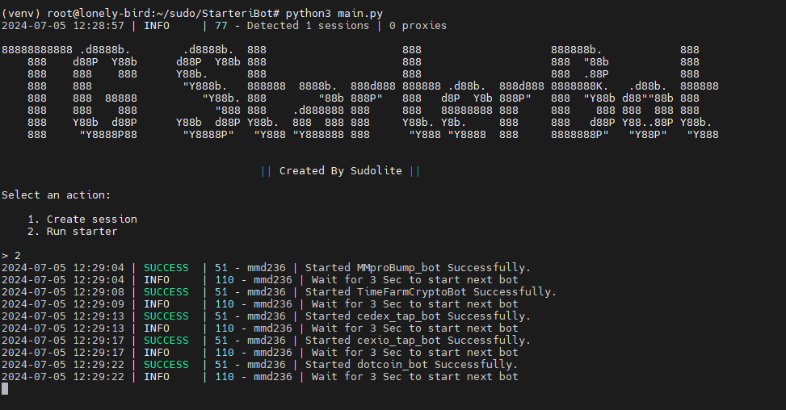

[](https://t.me/nethunterid)



## Functionality
| Functional                                                     | Supported |
|----------------------------------------------------------------|:---------:|
| Multithreading                                                 |     ✅     |
| Binding a proxy to a session                                   |     ✅     |
| Auto start all supported bots with your referral link          |     ✅     |
| Support tdata / pyrogram .session / telethon .session          |     ✅     |

## Bot List
| Bot Name                                                       | Supported |
|----------------------------------------------------------------|:---------:|
| MMproBump_bot                                                  |     ✅     |
| pixelversexyzbot                                               |     ✅     |
| cexio_tap_bot                                                  |     ✅     |
| memefi_coin_bot                                                |     ✅     |
| dotcoin_bot                                                    |     ✅     |
| TimeFarmCryptoBot                                              |     ✅     |
| wormfare_slap_bot                                              |     ✅     |
| cedex_tap_bot                                                  |     ✅     |
| tapswap_bot                                                    |     ✅     |
| wcoin_tapbot                                                   |     ✅     |

## [Settings](https://github.com/ivansuselo/TGStarterBot/blob/main/.env-example)
| Setting                   | Description                                                                   |
|---------------------------|-------------------------------------------------------------------------------|
| **API_ID / API_HASH**     | Platform data from which to launch a Telegram session (stock - Android)       |
| **START_NAME_BOT**        | Should I start bot _(True / False)_                     |
| **START_NAME_BOT_URL**    | MiniApp url of telegram bot _(https://example.com/)_                              |
| **START_NAME_BOT_STR**    | Text for start bot like referral _(refferalcode)_                                |
| **USE_PROXY_FROM_FILE**   | Whether to use proxy from the `bot/config/proxies.txt` file (True / False)    |

## Installation
You can download the [**Repository**](https://github.com/ivansuselo/TGStarterBot.git) by cloning it to your system and installing the necessary dependencies:
```shell
~ >>> git clone https://github.com/ivansuselo/TGStarterBot.git
~ >>> cd TGStarterBot

# If you are using Telethon sessions, then clone the "converter" branch
~ >>> git clone https://github.com/ivansuselo/TGStarterBot.git -b converter
~ >>> cd TGStarterBot

#Linux
~/TGStarterBot >>> python3 -m venv venv
~/TGStarterBot >>> source venv/bin/activate
~/TGStarterBot >>> pip3 install -r requirements.txt
~/TGStarterBot >>> cp .env-example .env
~/TGStarterBot >>> nano .env # Here you must specify your API_ID and API_HASH, the rest is taken by default
~/TGStarterBot >>> python3 main.py

#Windows
~/TGStarterBot >>> python -m venv venv
~/TGStarterBot >>> venv\Scripts\activate
~/TGStarterBot >>> pip install -r requirements.txt
~/TGStarterBot >>> copy .env-example .env
~/TGStarterBot >>> # Specify your API_ID and API_HASH, the rest is taken by default
~/TGStarterBot >>> python main.py
```

Also, for a quick launch, you can use arguments, for example:
```shell
~/TGStarterBot >>> python3 main.py --action (1/2)
# Or
~/TGStarterBot >>> python3 main.py -a (1/2)

#1 - Create session
#2 - Run Starter
```
